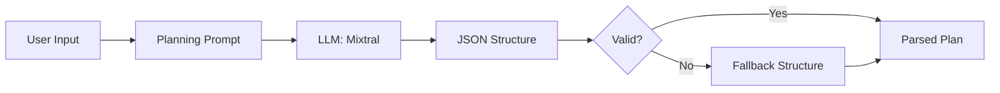
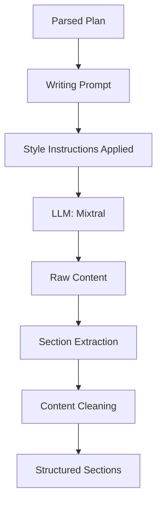
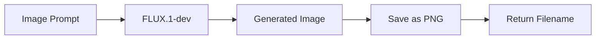
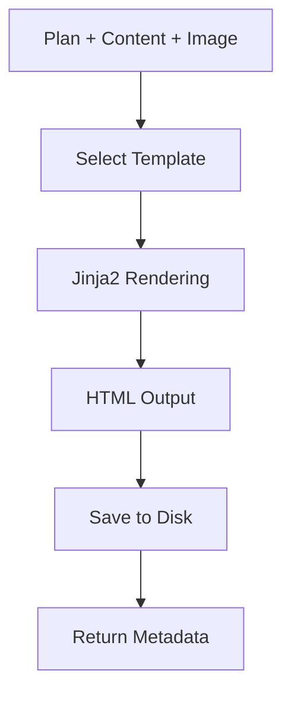

# 🤖 AI-Powered Static Site Generator

An intelligent system that generates complete, styled static websites using Large Language Models (LLMs) and AI image generation. Built with FastAPI, leveraging HuggingFace's Mixtral-8x7B and FLUX.1-dev models.

[](https://www.python.org/)
[](https://fastapi.tiangolo.com/)
[](https://www.docker.com/)

---

## 📋 Table of Contents

- [Features](#-features)
- [System Architecture](#-system-architecture)
- [Setup Instructions](#-setup-instructions)
- [How It Works](#-how-it-works)
- [Prompt Strategy](#-prompt-strategy)
- [API Documentation](#-api-documentation)
- [Frontend Usage](#-frontend-usage)
- [Docker Deployment](#-docker-deployment)
- [Project Structure](#-project-structure)
- [Troubleshooting](#-troubleshooting)

---

## ✨ Features

### Core Capabilities
- 🎨 **6 Unique Styles**: Educational, Marketing, Technical, Minimalist, Creative, Casual
- 🖼️ **AI Image Generation**: Automatic hero images using FLUX.1-dev
- 📱 **Responsive Design**: Mobile-first, adaptive layouts
- ⚡ **Fast Generation**: Parallel processing for multiple pages
- 📊 **Activity Logging**: Complete audit trail of all generations
- 🎯 **SEO Optimized**: Meta tags, semantic HTML, proper structure
- 🔧 **Configurable Parameters**: Temperature, top-p, token limits

### Technical Features
- **Async Processing**: Non-blocking API calls
- **Template Engine**: Jinja2 for flexible HTML rendering
- **Type Safety**: Pydantic models with validation
- **Error Handling**: Graceful fallbacks and recovery
- **Health Checks**: Built-in monitoring endpoints
- **CORS Support**: Cross-origin resource sharing enabled
- **Docker Ready**: Full containerization support

---

## 🏗️ System Architecture

### High-Level Overview

```
┌─────────────┐
│   Client    │ (Browser/CLI)
└──────┬──────┘
       │ HTTP Request
       ▼
┌─────────────────────┐
│   FastAPI Server    │
│  ┌───────────────┐  │
│  │  API Routes   │  │
│  └───────┬───────┘  │
│          │          │
│  ┌───────▼───────┐  │
│  │  Generator    │  │
│  │   Pipeline    │  │
│  └───────┬───────┘  │
└──────────┼──────────┘
           │
    ┌──────┴──────┐
    │             │
┌───▼────┐   ┌───▼────┐
│Mixtral │   │ FLUX   │
│ (LLM)  │   │(Image) │
└───┬────┘   └───┬────┘
    │            │
    └─────┬──────┘
          ▼
    ┌────────────┐
    │  HTML +    │
    │  Assets    │
    └────────────┘
```

### Components

1. **FastAPI Application** (`app/main.py`)
   - REST API endpoints
   - Static file serving
   - CORS middleware
   - Health checks

2. **Site Generator** (`app/generator.py`)
   - Orchestrates the generation pipeline
   - Manages LLM inference
   - Handles image generation
   - Template rendering

3. **Prompt Engineering** (`app/prompts.py`)
   - Dynamic prompt construction
   - Style-specific instructions
   - Section selection logic

4. **Template System** (`app/templates/`)
   - Style-specific HTML templates
   - Jinja2 templating
   - Responsive CSS

---

## 🚀 Setup Instructions

### Prerequisites

- Python 3.11 or higher
- Docker & Docker Compose (for containerized deployment)
- HuggingFace API token ([Get one here](https://huggingface.co/settings/tokens))

### Option 1: Local Development Setup

#### 1. Clone the Repository

```bash
git clone <repository-url>
cd site-generator
```

#### 2. Create Virtual Environment

```bash
python -m venv venv
source venv/bin/activate  
# On Windows: venv\Scripts\activate
```

#### 3. Install Dependencies

```bash
pip install -r requirements.txt
```

#### 4. Configure Environment Variables

Create a `.env` file in the root directory:

```env
HUGGINGFACEHUB_API_TOKEN=hf_your_token_here
SITES_DIR=./sites
```

#### 5. Run the Application

```bash
uvicorn app.main:app --reload --host 127.0.0.1 --port 8000
```

#### 6. Access the Application

- **Frontend**: http://localhost:8000
- **API Docs**: http://localhost:8000/docs
- **Health Check**: http://localhost:8000/ping

### Option 2: Docker Deployment

#### 1. Create `.env` File

```bash
echo "HUGGINGFACEHUB_API_TOKEN=your_token_here" > .env
```

#### 2. Build and Run

```bash
docker-compose up --build
```

#### 3. Access the Application

- **Frontend**: http://localhost:8000
- **Generated Sites**: Stored in `./sites/` directory

---

## 🔄 How It Works

### Generation Pipeline

The system follows a multi-stage pipeline to generate complete websites:

#### **Stage 1: Planning (Structure Generation)**



**What happens:**
1. User provides topic and style
2. System constructs a planning prompt
3. LLM generates JSON with:
   - Title (max 70 chars)
   - Meta description (50-160 chars)
   - Image prompt (20-50 chars)
   - Section structure (3-5 sections)
4. JSON is parsed and validated
5. Fallback structure used if parsing fails

**Example Planning Output:**
```json
{
  "title": "Machine Learning Fundamentals",
  "meta_description": "Comprehensive guide to ML concepts, algorithms, and applications",
  "image_prompt": "Abstract neural network visualization with data flowing",
  "sections": [
    {"heading": "Introduction", "brief": "Overview of machine learning"},
    {"heading": "Key Features", "brief": "Core ML capabilities"},
    {"heading": "Use Cases", "brief": "Real-world applications"},
    {"heading": "Summary", "brief": "Key takeaways"}
  ]
}
```

#### **Stage 2: Content Generation**



**What happens:**
1. For each section in the plan:
   - Construct style-specific prompt
   - Include section heading and brief
   - Specify word count based on style
2. LLM generates content (80-150 words per section)
3. Content is parsed using `###` separators
4. Each section is matched to its heading
5. Content is cleaned and formatted

**Style-Specific Content:**
- **Educational**: Clear explanations, examples, structured
- **Marketing**: Persuasive, benefit-focused, energetic
- **Technical**: Detailed, code examples, precise
- **Minimalist**: Concise, essential information only
- **Creative**: Vivid language, storytelling, engaging
- **Casual**: Conversational, simple, friendly

#### **Stage 3: Image Generation (Optional)**



**What happens:**
1. Extract image_prompt from plan
2. Send to FLUX.1-dev model with:
   - Negative prompt: "low quality, blurry, distorted"
   - Guidance scale: 7.5
   - Steps: 30
   - Size: 512x512
3. Save to `sites/image_{site_id}.png`
4. Return filename for HTML template

#### **Stage 4: HTML Rendering**



**What happens:**
1. Select template based on style:
   - `educational.html` - Structured, informative
   - `marketing.html` - Bold, conversion-focused
   - `technical.html` - Clean, code-friendly
   - `minimalist.html` - Typography-first, minimal
   - `creative.html` - Artistic, expressive
   - `base.html` - Generic fallback
2. Render with Jinja2:
   - Insert title, meta description
   - Loop through sections
   - Add image if available
   - Include generation timestamp
3. Save to `sites/site_{site_id}.html`
4. Return metadata for API response

---

## 🎯 Prompt Strategy

### Philosophy

The prompt strategy is designed to:
1. **Ensure Consistency**: Fixed section structure
2. **Enable Creativity**: Temperature variation per request
3. **Maintain Quality**: Fallback mechanisms
4. **Style Differentiation**: Unique instructions per style

### Planning Prompt Architecture

#### **Structure**
```python
def planning_prompt(topic: str, style: str):
    sections = choose_sections()
    style_instr = STYLE_INSTRUCTIONS.get(style, STYLE_INSTRUCTIONS["educational"])
    
    prompt = f"""
You are an expert web content planner creating a structure for a website about: "{topic}".
Style: {style} - {style_instr}

Create a JSON structure with these fields:
- title: A compelling, clear title (max 70 characters) that captures the essence of {topic}
- meta_description: An engaging description (50-160 chars) that would make someone want to click
- image_prompt: A detailed, vivid description for generating an image (20-50 chars). Be specific and visual.
- sections: An array of EXACTLY {len(sections)} section objects

For sections array, use these headings in EXACT order: {', '.join(sections)}
Each section object must have:
  - "heading": The exact heading from the list above
  - "brief": A clear, specific 1-sentence description of what this section should cover

CRITICAL RULES:
1. First section ({sections[0]}) must introduce the topic clearly
2. Middle sections provide detailed information, examples, or insights
3. Last section ({sections[-1]}) must conclude or provide a call-to-action
4. Return ONLY valid JSON - no markdown code blocks, no explanations, no extra text
5. Use double quotes for all JSON strings
6. Each "brief" should be specific to the topic, not generic

Example of good briefs:
- "Explain what {topic} is and why it matters"
- "List 3-5 practical applications of {topic} in real-world scenarios"
- "Summarize key takeaways and encourage readers to explore {topic} further"

Return the JSON now:"""
    return prompt
```

#### **Section Selection Logic**

Sections are chosen to ensure logical flow:

```python
INTRO_SECTIONS = ["Introduction", "Overview"]
CORE_SECTIONS = ["Use Cases", "Technical Details", "Key Features", ...]
OUTRO_SECTIONS = ["Summary", "Conclusion", "Summary and CTA"]

# Always: Intro → Core(1-3) → Outro
sections = [random.choice(INTRO)] + 
           [random.sample(CORE, 1-3)] + 
           [random.choice(OUTRO)]
```

**Why this works:**
- ✅ Natural narrative flow
- ✅ No conclusion before introduction
- ✅ Consistent structure across generations
- ✅ Variation within constraints

#### **Key Prompt Elements**

1. **Role Definition**: "You are an expert web content planner"
2. **Task Specificity**: Exact JSON schema required
3. **Constraints**: Character limits, section count
4. **Output Format**: "Return ONLY valid JSON"

### Writing Prompt Architecture

#### **Structure**
```python
def writing_prompt(topic, style, title, sections):
    style_guide = STYLE_SPECIFIC[style]
    word_count = WORD_COUNTS[style]
    
    prompt = f"""
    You are writing content for "{title}" about {topic}
    
    STYLE: {style} - {style_guide}
    APPROACH: {detailed_instructions}
    
    For each section ({word_count} words):
    ### Section Heading
    [Your content here]
    """
```

#### **Style-Specific Parameters**

| Style | Word Count | Focus | Tone |
|-------|-----------|-------|------|
| Educational | 80-120 | Clarity, examples | Informative |
| Marketing | 60-90 | Benefits, CTA | Persuasive |
| Technical | 100-150 | Details, code | Precise |
| Minimalist | 40-70 | Essentials only | Concise |
| Creative | 90-130 | Storytelling | Engaging |
| Casual | 70-100 | Simplicity | Friendly |

#### **Content Extraction Strategy**

After LLM generates content:

```python
# Split by ### separator
parts = full_text.split("###")

# Match each section to its heading
for section in planned_sections:
    for part in parts:
        if part.startswith(section.heading):
            content = extract_after_heading(part)
            break
    
    # Fallback to brief if not found
    if not content:
        content = section.brief
```

### Temperature & Randomization

```python
# User-specified temperature (0.1-1.5)
base_temp = request.temperature

# Add small random variation
actual_temp = base_temp + random.uniform(-0.1, 0.1)

# Ensures creativity variation even with same input
```

### Prompt Engineering Best Practices Used

1. ✅ **Clear Instructions**: Explicit format requirements
2. ✅ **Role Assignment**: "You are an expert..."
3. ✅ **Constraints**: Character limits, word counts
4. ✅ **Structured Output**: Use ### separators
5. ✅ **Negative Instructions**: "Do NOT add extra text"
6. ✅ **Context Provision**: Topic, style, brief included
7. ✅ **Format Specification**: JSON schema, markdown

---

## 📚 API Documentation

### Endpoints

#### **POST /generate**

Generate one or more websites.

**Request Body:**
```json
{
  "topic": "Machine Learning",
  "pages_count": 3,
  "style": "educational",
  "temperature": 0.8,
  "top_p": 0.95,
  "max_tokens": 1200,
  "generate_image": true
}
```

**Parameters:**

| Parameter | Type | Required | Default | Description |
|-----------|------|----------|---------|-------------|
| topic | string | Yes | - | Website topic (3-200 chars) |
| pages_count | integer | No | 1 | Number of pages (1-50) |
| style | string | No | "educational" | Style: educational, marketing, technical, minimalist, creative, casual |
| temperature | float | No | 0.8 | LLM temperature (0.1-1.5) |
| top_p | float | No | 0.95 | Top-p sampling (0.1-1.0) |
| max_tokens | integer | No | 1200 | Max tokens (500-3000) |
| generate_image | boolean | No | true | Generate AI image |

**Response:**
```json
[
  {
    "site_id": "27b5b25e94a9407598df5fcd5f49d255",
    "title": "Machine Learning Fundamentals",
    "meta_description": "Comprehensive guide to ML...",
    "image_path": "image_27b5b25e....png",
    "file_path": "./sites/site_27b5b25e....html",
    "style": "educational",
    "sections_count": 4,
    "created_at": "2025-10-15T10:30:00Z"
  }
]
```

**cURL Example:**
```bash
curl -X POST "http://localhost:8000/generate" \
  -H "Content-Type: application/json" \
  -d '{
    "topic": "Python Programming",
    "pages_count": 1,
    "style": "educational",
    "generate_image": false
  }'
```

#### **GET /site/{site_id}**

Retrieve generated HTML site.

**Response:** HTML content

**Example:**
```bash
curl http://localhost:8000/site/27b5b25e94a9407598df5fcd5f49d255
```

#### **GET /image/{filename}**

Retrieve generated image.

**Response:** PNG image

**Example:**
```bash
curl http://localhost:8000/image/image_27b5b25e94a9407598df5fcd5f49d255.png
```

#### **GET /logs**

Get all generation logs.

**Response:**
```json
[
  {
    "site_id": "...",
    "title": "...",
    "created_at": "...",
    "style": "educational"
  }
]
```

#### **GET /stats**

Get usage statistics.

**Response:**
```json
{
  "total_sites": 42,
  "total_requests": 38,
  "styles_distribution": {
    "educational": 15,
    "marketing": 12,
    "technical": 8,
    "minimalist": 7
  },
  "popular_topics": {
    "Machine Learning": 5,
    "Web Development": 3
  }
}
```

#### **GET /ping**

Health check endpoint.

**Response:**
```json
{
  "status": "ok",
  "message": "API is running"
}
```

---

## 🎨 Frontend Usage

### Web Interface

1. **Open Browser**: Navigate to `http://localhost:8000`

2. **Fill Form**:
   - **Topic**: Enter your website topic (e.g., "Quantum Computing")
   - **Style**: Select from dropdown
   - **Pages**: Number of variations to generate
   - **Temperature**: Creativity slider (higher = more creative)
   - **Top P**: Diversity slider
   - **Max Tokens**: Content length
   - **Generate Image**: Toggle AI image generation

3. **Generate**: Click "Generate Sites" button

4. **View Results**: 
   - Cards appear with site metadata
   - Click "View Site →" to open in new tab
   - Check "View Generation Logs" for history

### CLI Usage


#### Using cURL

```bash
# Simple generation
curl -X POST http://localhost:8000/generate \
  -H "Content-Type: application/json" \
  -d '{"topic":"Cooking","style":"casual"}'

# Advanced parameters
curl -X POST http://localhost:8000/generate \
  -H "Content-Type: application/json" \
  -d '{
    "topic": "Artificial Intelligence",
    "pages_count": 2,
    "style": "technical",
    "temperature": 0.9,
    "max_tokens": 1500,
    "generate_image": true
  }'
```

---

## 🐳 Docker Deployment

### Quick Start

```bash
# Build and run
docker-compose up --build

# Run in background
docker-compose up -d

# View logs
docker-compose logs -f

# Stop
docker-compose down
```


### Volume Mapping

The `./sites` directory is mapped to `/app/sites` in the container:

```yaml
volumes:
  - ./sites:/app/sites
```

All generated files are persisted on your host machine.

---


## 📂 Project Structure

```
site-generator/
├── app/
│   ├── __init__.py
│   ├── main.py                 # FastAPI application
│   ├── generator.py            # Core generation logic
│   ├── models.py               # Pydantic models
│   ├── prompts.py              # Prompt engineering
│   ├── utils.py                # Helper functions
│   ├── frontend.html           # Web interface
│   └── templates/
│       ├── base.html           # Base template
│       ├── educational.html    # Educational style
│       ├── marketing.html      # Marketing style
│       ├── technical.html      # Technical style
│       ├── minimalist.html     # Minimalist style
│       └── creative.html       # Creative style
│
├── sites/                      # Generated sites (auto-created)
│   ├── site_*.html
│   └── image_*.png
│
├── Dockerfile                  # Docker container definition
├── docker-compose.yml          # Docker Compose config
├── .dockerignore              # Docker ignore patterns
├── requirements.txt            # Python dependencies
├── .env                        # Environment variables (not in git)
├── .gitignore                 # Git ignore patterns
├── README.md                   # This file
└── generate.py                 # CLI script
```

### Key Files Explained

| File | Purpose |
|------|---------|
| `main.py` | API routes, middleware, server setup |
| `generator.py` | Orchestrates LLM calls, image generation, HTML rendering |
| `prompts.py` | Prompt construction, section selection |
| `models.py` | Request/response validation with Pydantic |
| `utils.py` | UUID generation, timestamps, directory management |
| `frontend.html` | Interactive web UI for generation |
| `templates/*.html` | Style-specific HTML templates with Jinja2 |

---

## 🔧 Troubleshooting

### Common Issues

#### Issue: "API Token Invalid"

**Symptoms:** 401 Unauthorized errors

**Solution:**
```bash
# Check your .env file
cat .env | grep HUGGINGFACEHUB_API_TOKEN

# Verify token on HuggingFace
curl -H "Authorization: Bearer YOUR_TOKEN" \
  https://huggingface.co/api/whoami
```

#### Issue: "Image Generation Fails"

**Symptoms:** Sites generate without images

**Possible causes:**
- HuggingFace API rate limit reached
- FLUX model temporarily unavailable
- Network connectivity issues

**Solution:**
```python
# Disable image generation temporarily
"generate_image": false
```

#### Issue: "JSON Parsing Error"

**Symptoms:** Logs show "JSON parsing failed"

**Cause:** LLM returned invalid JSON

**Solution:** System uses fallback structure automatically. To improve:
- Lower temperature (0.6-0.7)
- Simplify topic description
- Try different style

#### Issue: "Port Already in Use"

**Symptoms:** `Address already in use` error

**Solution:**
```bash
# Find process using port 8000
lsof -i :8000

# Kill process
kill -9 <PID>

# Or use different port
uvicorn app.main:app --port 8001
```

#### Issue: "Docker Container Exits Immediately"

**Symptoms:** Container starts then stops

**Solution:**
```bash
# Check logs
docker-compose logs app

# Common issue: missing .env file
ls -la .env

# Rebuild with no cache
docker-compose build --no-cache
```

### Getting Help

1. **Check Logs**: `docker-compose logs -f` or console output
2. **API Documentation**: Visit `/docs` endpoint
3. **Test Health**: `curl http://localhost:8000/ping`

---

## 🙏 Acknowledgments

- **HuggingFace** for model hosting and inference API
- **FastAPI** for the excellent web framework
- **Mistral AI** for the Mixtral-8x7B model
- **Black Forest Labs** for FLUX.1-dev image model

---


## 🌟 Star History

If you find this project useful, please consider giving it a star! ⭐

---


## 📝 Changelog

### v1.0.0 (October 2025)
- ✨ Initial release
- 🎨 6 unique styles implemented
- 🖼️ AI image generation support
- 🐳 Docker deployment ready
- 📱 Web frontend interface
- 📊 Logging and stats endpoints
- 🔧 Configurable parameters

### Upcoming (v1.1.0)
- 🗄️ Database integration
- 🔄 Retry logic for API calls
- 💾 Request caching
- 📈 Quality scoring
- 🌐 Multi-language support

---

*For the latest updates, check the repository regularly!*